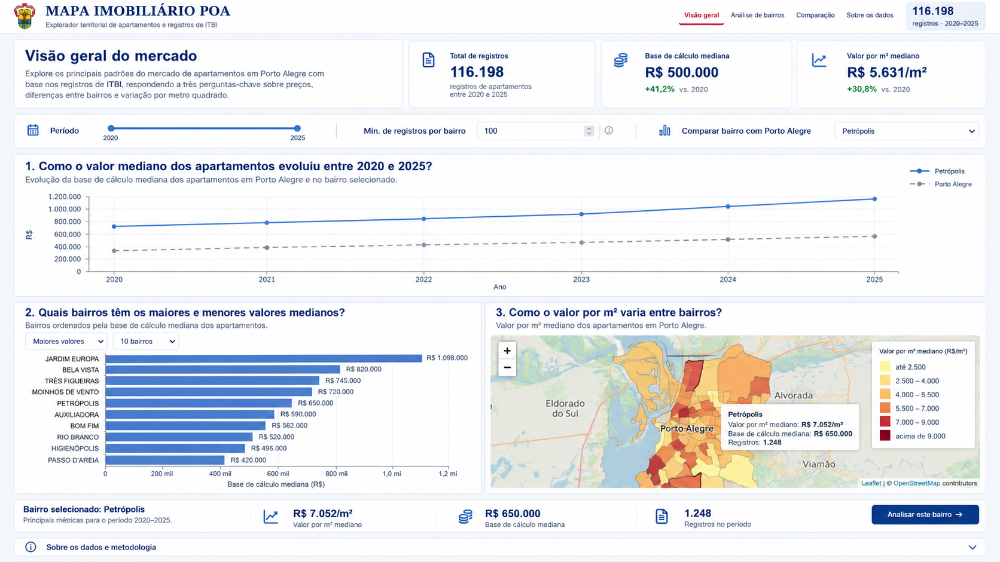
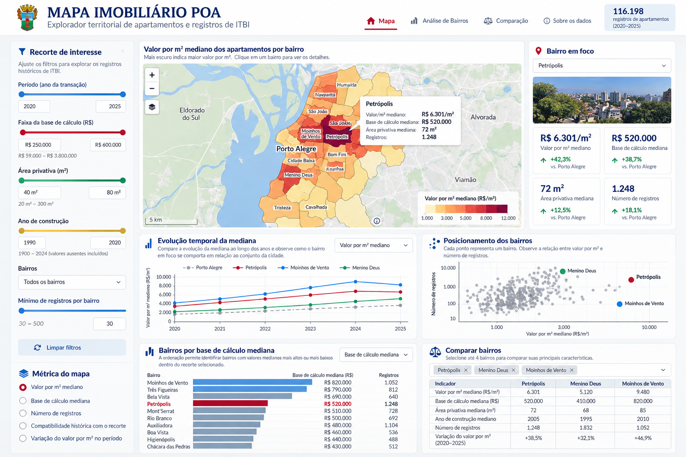

# Atlas das Transações Imobiliárias — POA

Estudo dos registros de ITBI de Porto Alegre (2020–2025).

## Navegação e arquitetura de informação

A aplicação abre em **Visão geral**, seguindo a referência visual aprovada: introdução,
três indicadores da cidade, filtros simples, linha em largura total, barras e mapa lado
a lado, resumo do bairro e metodologia. A página permite rolagem vertical.

- **P1 — Como o valor mediano dos apartamentos evoluiu entre 2020 e 2025?** Linha Plotly
  da mediana de `base_de_calculo` por ano, com Porto Alegre e, opcionalmente, um bairro.
  O tooltip informa ano, região, mediana e registros. O mínimo não remove a série da cidade.
- **P2 — Quais bairros têm os maiores e menores valores medianos?** Barras horizontais
  Plotly: primeiro exigem a amostra mínima, depois ordenam a mediana de `base_de_calculo`.
  Controles locais alternam maiores/menores e 5/10 bairros, sem ordenar por volume.
- **P3 — Como o valor por m² varia entre bairros?** Mapa Folium com mediana de `valor_m2`,
  paleta YlOrRd e os 94 polígonos oficiais. Amostras insuficientes ficam cinza. JAR ITU
  SABARA permanece nos cálculos tabulares, sem geometria artificial.

**Análise de bairros** preserva o dashboard de uma tela: filtros detalhados, compatibilidade
histórica, cinco métricas de mapa, indicadores, evolução, dispersão, barras Altair e comparação.
Seu grid continua com linhas de 22%, 48% e 30%. A tabela de comparação de até quatro bairros
permanece dentro da Análise de bairros; não há aba de comparação na navegação. **Sobre os dados**
abre o mesmo diálogo em qualquer página.

### Estado e integração

`state.view` persiste `overview`, `analysis` ou `comparison`. O período `years` é compartilhado.
`state.overview` guarda mínimo (inicial 100), foco (inicial nenhum), ordenação e quantidade
(inicial 10). Os filtros de valor, área, construção, bairros e métrica são exclusivos da análise;
nunca restringem silenciosamente o panorama. Trocar de view preserva esses filtros.

Barras, mapa e seletor atualizam o foco da Visão geral. **Analisar este bairro →** abre a análise
com esse bairro e período, reiniciando os filtros avançados para que o bairro não fique oculto.
A seleção do mapa usa uma mensagem do iframe Folium validada pela janela de origem e pelo nome
existente na base. O seletor oferece a alternativa de acesso por teclado.

`app.py` continua um host fino. `dashboard_view.py` monta o payload analítico e o bloco
`overview`; HTML/CSS/JS compõem as views e as interações. Não há cálculo de medianas no JavaScript.
Nenhum valor do mockup é usado como dado. Base de cálculo é a base fiscal do ITBI, não
necessariamente preço de mercado; valor/m² deriva dessa base. Os deltas dos KPIs comparam
as medianas anuais dos extremos do período, enquanto o valor principal é a mediana do período.

### Arquivos do layout

- `dashboard/index.html`, `dashboard.css`, `dashboard.js`: componente local com grade,
  controles HTML e gráficos ajustados às dimensões reais dos contêineres.
- `dashboard_view.py`: adapta os cálculos Python existentes ao componente.
- `dashboard/vendor/`: Plotly e Vega locais; execução não requer Node/npm.
- `visual_check.py`: verificação no Chrome isolado, zoom 100%, medições e capturas.
- `artifacts/visual/`: evidências das três resoluções, seletores e comparação.

### Reproduzir a verificação visual

Com Google Chrome instalado e o servidor ativo em `localhost:8501`, use o Python do
ambiente virtual criado na seção **Instalação** (no Windows, o caminho completo indicado lá):

```bash
python -m pip install playwright==1.63.0
python visual_check.py
```

Playwright é uma dependência de desenvolvimento. O teste usa perfil temporário e escala
de dispositivo 1. Confere as duas páginas em 1366×768, 1536×864 e 1920×1080; permite scroll vertical na Visão geral e exige viewport único na análise;
tooltip do mapa; filtros; quatro bairros; ausentes; bairro sem geometria e mínimo alto.
Abaixo de 1050 px de largura, permite rolagem para preservar a leitura; esse modo fica
fora do requisito desktop. Folium/Leaflet e os tiles OpenStreetMap usam recursos de rede.

Capturas da análise: [1366×768](artifacts/visual/dashboard-1366x768.png),
[1536×864](artifacts/visual/dashboard-1536x864.png),
[1920×1080](artifacts/visual/dashboard-1920x1080.png).

IA001 — Análise e Visualização de Dados (Especialização em IA Avançada, INF-UFRGS). Atividade 02: dashboard interativo em Streamlit.

Grupo: Giulia Giozza, Richard Ramos, Eduardo Mello.

## Estrutura

Todos os comandos abaixo são executados dentro desta pasta (`atividade02_dashboard_streamlit.ipynb/`).

| Arquivo | O que é |
|---|---|
| `app.py` | Aplicação Streamlit |
| `charts.py` | Construtores dos gráficos; um por visualização |
| `.streamlit/config.toml` | Tema visual do dashboard inspirado na bandeira e no brasão de Porto Alegre |
| `pipeline.py` | Carga da API e funil de preparação (mesmas regras da Atividade 01) |
| `geo.py` | Limites oficiais dos bairros e casamento com os nomes do ITBI |
| `prepare_data.py` | Gera os arquivos em `data/` |
| `check_data.py` | Confere os dados contra os números entregues na Atividade 01 |
| `data/apartamentos_itbi_poa.parquet` | Base analítica (um apartamento por linha) |
| `data/bairros_poa.geojson` | Limites dos bairros (WGS84) |
| `data/bairros_correspondencia.csv` | Nome no ITBI → nome oficial |
| `data/funil.csv` | Registros restantes após cada etapa |
| `docs/escopo.md` | Público, perguntas, gráficos e filtros do dashboard |
| `docs/padroes_de_design.md` | Padrão de design, interação e implementação das visualizações |
| `tasks.md` | Tarefas do grupo e status |
| `atividade02_dashboard_streamlit.ipynb` | Notebook da atividade (com o Registro do grupo) |

## Instalação

Requer **Python 3.11 ou superior** (validado com Python 3.13 no Windows) e acesso à internet
para instalar os pacotes. Baixe ou clone o projeto e abra um terminal na pasta que contém
`app.py` e `requirements.txt`: `atividade02_dashboard_streamlit.ipynb/`.
Apesar do nome, essa pasta é um diretório; o notebook está dentro dela.

### Windows — PowerShell

Use um caminho curto para o ambiente virtual, evitando o limite de caminhos do Windows.
Não é necessário ativar o ambiente nem alterar a política de execução do PowerShell.

```powershell
# Execute dentro da pasta que contém app.py.
python -m venv "$env:LOCALAPPDATA\venvs\atlas-poa"
& "$env:LOCALAPPDATA\venvs\atlas-poa\Scripts\python.exe" -m pip install --upgrade pip
& "$env:LOCALAPPDATA\venvs\atlas-poa\Scripts\python.exe" -m pip install -r requirements.txt
```

### Linux / macOS

```bash
# Execute dentro da pasta que contém app.py.
python3 -m venv .venv
source .venv/bin/activate
python -m pip install --upgrade pip
python -m pip install -r requirements.txt
```

O `requirements.txt` inclui as dependências da aplicação e dos scripts de preparação e
verificação dos dados. Playwright é opcional e só é necessário para os testes visuais.
Não é necessário instalar Node.js nem npm; Plotly e Vega do componente estão em `dashboard/vendor/`.

## Executar o dashboard

Os arquivos preparados `data/apartamentos_itbi_poa.parquet` e `data/bairros_poa.geojson`
já acompanham o projeto. Preserve também as pastas `dashboard/` e `assets/`.
Não é necessário regenerar os dados para abrir a aplicação.

**Windows — PowerShell:**

```powershell
& "$env:LOCALAPPDATA\venvs\atlas-poa\Scripts\python.exe" -m streamlit run app.py
```

**Linux / macOS**, com o ambiente ativado:

```bash
python -m streamlit run app.py
```

Abra **http://localhost:8501** no navegador, ou o endereço informado no terminal.
A aplicação inicia em Visão geral; use Análise de bairros para explorar os filtros detalhados.
O mapa-base OpenStreetMap e os recursos externos do Folium precisam de internet.
Para encerrar, pressione `Ctrl+C` no terminal. Se a porta estiver ocupada, acrescente
`--server.port 8502` ao comando e abra **http://localhost:8502**.

### Verificar a instalação e os cálculos

No Windows:

```powershell
& "$env:LOCALAPPDATA\venvs\atlas-poa\Scripts\python.exe" -m pip check
& "$env:LOCALAPPDATA\venvs\atlas-poa\Scripts\python.exe" test_dashboard.py
& "$env:LOCALAPPDATA\venvs\atlas-poa\Scripts\python.exe" check_data.py
```

No Linux/macOS, com o ambiente ativado:

```bash
python -m pip check
python test_dashboard.py
python check_data.py
```

`test_dashboard.py` usa os dados locais. `check_data.py` consulta a API municipal se o cache
`data/raw/` não estiver disponível, por isso pode precisar de internet.

### Testes visuais opcionais

Requer Google Chrome instalado e a aplicação aberta em outro terminal. No Windows:

```powershell
& "$env:LOCALAPPDATA\venvs\atlas-poa\Scripts\python.exe" -m pip install playwright==1.63.0
& "$env:LOCALAPPDATA\venvs\atlas-poa\Scripts\python.exe" visual_check.py
```

No Linux/macOS, use `python -m pip install playwright==1.63.0` e `python visual_check.py`
no ambiente ativado. O teste usa o Chrome instalado, sem exigir download de outro navegador.
Para outra porta no PowerShell, defina `$env:DASHBOARD_URL='http://localhost:8502'`.

## Regenerar os dados (opcional)

Os comandos abaixo usam o Python do ambiente virtual. No Windows, substitua `python` por
`& "$env:LOCALAPPDATA\venvs\atlas-poa\Scripts\python.exe"`. No Linux/macOS, mantenha o ambiente ativado.

```bash
python prepare_data.py            # baixa da API (~20 s) e guarda cache em data/raw/
python prepare_data.py --refresh  # ignora o cache e baixa de novo
python check_data.py              # confere contra a Atividade 01
```

### Funil de preparação

| Etapa | Registros |
|---|---|
| Registros consolidados (2020–2025) | 326.623 |
| Sem duplicatas | 324.323 |
| Apartamentos em guias de unidade única | 119.493 |
| Valor e área privativa válidos | 119.492 |
| Sem ZN INDEFINIDA 2 | 118.655 |
| Sem bairro vazio | 118.568 |
| Sem atípicos (valor/m² entre P1 e P99) | 116.198 |

## Fontes dos dados

- ITBI, Prefeitura de Porto Alegre (Divisão da Receita Imobiliária). Portal de Dados Abertos: https://dadosabertos.poa.br/dataset/itbi. Licença Creative Commons Attribution. Acessado pela API `datastore_search`, com um `resource_id` por ano (ver `pipeline.py`).
- Limites de bairros, LC 12.112/2016 (SMURB/PMPA): https://dadosabertos.poa.br/dataset/a7172700-e0e2-4797-bf4a-12f658828568


## Explorador territorial

O mapa é o centro da aplicação. O público são famílias e compradores interessados em
compreender padrões históricos, além de corretores e avaliadores. A base não descreve
imóveis atualmente anunciados ou disponíveis.

### Perguntas e recursos

- **P1:** Como o valor mediano dos apartamentos evoluiu entre 2020 e 2025?
  Linhas Plotly: base de cálculo mediana (padrão) ou valor/m², referência da cidade e
  até quatro bairros. Tooltip com ano, região, mediana e quantidade.
- **P2:** Quais bairros têm os maiores e menores valores medianos?
  Barras Altair ordenáveis, padrão base de cálculo mediana, com mínimo de registros.
- **P3:** Como o valor por metro quadrado varia entre bairros?
  Mapa Folium agrupado por nome oficial, mantendo os 94 polígonos.
- Complementos: dispersão Plotly, painel do bairro em foco e tabela de até quatro bairros.
  Os números vêm do Parquet. Não há fotos de bairros nem dados ilustrativos.

### Filtros e cálculos

O panorama começa com todos os anos, bairros, valores e áreas, sem restrição de construção.
Contexto = período e bairros. Perfil = base de cálculo, área e construção.
Bairros sem seleção significa todos. Recorte sem registros gera aviso.
Limpar filtros restaura o panorama. Os limites das faixas vêm dos dados.

Há 23.154 registros sem ano de construção, mantidos por padrão; quando o filtro é ativado,
uma opção permite incluí-los ou excluí-los. O período usa o ano da base, sem assumir que
data_estimativa seja a data de venda.

Modos do mapa: valor/m², base de cálculo, quantidade, compatibilidade histórica e variação.
Compatibilidade = 100 × registros compatíveis / registros avaliados no bairro antes dos
filtros de perfil. O contexto conserva o período e os bairros escolhidos.
O mínimo (padrão 100) aplica-se ao denominador nesse modo. Zero observado difere de
ausência de contexto. Nas outras métricas, o mínimo se aplica à amostra filtrada.

Variação = 100 × (mediana final / mediana inicial − 1), nos anos extremos do intervalo.
Exige o mínimo em ambos os extremos; um único ano ou amostra insuficiente fica indisponível.
As séries não interpolam anos com poucos registros. Valores são nominais: não representam
retorno e podem refletir mudanças de composição.

Porto Alegre usa os mesmos filtros de período e perfil e todos os bairros, mesmo quando
a seleção territorial restringe as comparações locais. Medianas da cidade são calculadas
sobre registros, não pela média das medianas dos bairros. JAR ITU SABARA permanece nas
tabelas e séries, sem associação artificial a um polígono.

### Metodologia e limitações

Base de cálculo é uma medida fiscal, não preço de mercado confirmado. Valor/m² é a base
dividida pela área privativa. Transmissões parciais, corte P1–P99 e exclusão de guias
multiunidade são preservados. A mediana de construção considera apenas anos informados.
Contagens são registros selecionados, não imóveis únicos, estoque, liquidez ou tempo de venda.

### Código e validação

- metrics.py: filtros, agregações, compatibilidade, variação e formatação brasileira.
- app.py: estado, controles, tratamento de vazio e renderização.
- charts.py: construtores sem chamadas Streamlit.
- test_dashboard.py: cálculos e cenários de filtros com Streamlit AppTest.

Pipeline, geo.py, prepare_data.py, check_data.py e dados preparados são preservados.
O uso normal não consulta a API; o mapa-base OpenStreetMap depende de rede.
A seleção do bairro usa selectbox estável, com contorno azul no mapa.

Na pasta do aplicativo:

    python test_dashboard.py
    python check_data.py
    python -m streamlit run app.py

check_data.py consulta a API quando data/raw não está disponível.

## Capturas e comandos da Visão geral

Capturas completas do conteúdo: [1366×768](artifacts/visual/overview-content-1366x768.png),
[1536×864](artifacts/visual/overview-content-1536x864.png),
[1920×1080](artifacts/visual/overview-content-1920x1080.png).
As imagens `overview-selected-*` mostram um bairro selecionado. `overview-*` mostra o viewport
com cabeçalho. As medidas ficam em JSON na mesma pasta.

Os comandos para instalar, executar e testar estão nas seções **Instalação** e
**Executar o dashboard** acima.

---

## IA001 — Análise e Visualização de Dados com Python e Ferramentas Assistidas por IA

## Atividade 01 — Proposta de análise visual de dados

**Objetivo:** escolher um conjunto de dados, realizar uma exploração inicial e propor perguntas que possam orientar uma ferramenta de visualização.

**Produto da atividade:** este notebook preenchido, com respostas, código executado, estatísticas, gráficos e referências.

## IA001 — Análise e Visualização de Dados com Python e Ferramentas Assistidas por IA

## Atividade 02 — Dashboard interativo com Streamlit

**Objetivo:** dar continuidade à Atividade 01, transformando a proposta de análise visual em um dashboard que permita explorar os dados e investigar as perguntas do grupo.

Trabalhem no mesmo grupo (até 3 integrantes) e utilizem o conjunto de dados da atividade anterior. Se precisarem alterar os dados ou as perguntas, justifiquem brevemente.

### O que desenvolver

Criem uma aplicação em **Streamlit** voltada ao público identificado na Atividade 01. O dashboard deve:

- Investigar **pelo menos duas perguntas** propostas na atividade anterior.
- Conter **pelo menos três visualizações**, utilizando **ao menos duas** das bibliotecas estudadas: Altair, Plotly, Seaborn, Matplotlib ou Folium. Escolham as bibliotecas de acordo com os dados e as perguntas; mapas são opcionais quando houver informação geográfica. Streamlit é a estrutura da aplicação e não conta como uma das duas bibliotecas de visualização.
- Oferecer **pelo menos dois controles interativos**, como seleção de categorias, período ou região, que atualizem as visualizações pertinentes. Informem quando uma seleção não produzir dados.
- Apresentar títulos, rótulos, unidades, fonte dos dados e textos curtos que ajudem o usuário a interpretar os resultados.

Vocês podem adaptar os exemplos dos notebooks da aula. Confiram se os filtros e os cálculos produzem resultados coerentes com os dados.

### Entrega

Entreguem uma pasta ou arquivo ZIP com:

1. A aplicação (`app.py` e eventuais arquivos auxiliares).
2. Um `requirements.txt` e instruções de instalação e execução em um `README.md`.
3. Os dados necessários, quando o compartilhamento for permitido, ou instruções reproduzíveis para obtê-los.
4. Este notebook preenchido com o registro breve abaixo.

A aplicação deve executar localmente. A publicação na internet é opcional. Antes de entregar, testem a execução seguindo o próprio README e experimentem diferentes combinações dos filtros.

**Critérios de qualidade:** continuidade com a proposta, adequação dos gráficos às perguntas, funcionamento das interações, clareza da interface e possibilidade de reproduzir a execução.

### Registro do grupo

**Grupo e integrantes:**

| Integrante |
| --- |
| Giulia Giozza |
| Richard Ramos |
| Eduardo Mello |

**Perguntas da Atividade 01 contempladas pelo dashboard:**

1. Como o valor mediano dos apartamentos evoluiu entre 2020 e 2025?
2. Quais bairros têm os maiores e menores valores medianos?
3. Como o valor por m² varia entre bairros?

As três perguntas aparecem explicitamente na Visão geral. A Análise de bairros permite
aprofundá-las por período e perfil dos registros. Os valores analisados são a base fiscal
do ITBI e o valor por m² derivado dessa base.

**Visualizações e bibliotecas utilizadas — justifiquem brevemente as escolhas:**

| Visualização | Biblioteca | Justificativa |
| --- | --- | --- |
| Linhas de evolução anual das medianas | Plotly | Permitem acompanhar a evolução temporal e comparar o bairro selecionado com Porto Alegre, com valores e contagens nos tooltips. |
| Barras horizontais de maiores e menores medianas na Visão geral | Plotly | Facilitam a leitura dos nomes e a comparação entre bairros, com ordenação e seleção por clique. |
| Barras de medianas na Análise de bairros | Altair | Permitem comparar as medianas por bairro no recorte escolhido, alternando métrica e ordenação. |
| Mapa coroplético dos bairros | Folium | Mostra a distribuição territorial do valor por m², preservando os limites oficiais e indicando amostras insuficientes em cinza. |
| Dispersão do valor por m² versus número de registros | Plotly | Permite observar o posicionamento dos bairros e destacar o bairro em foco. |

Streamlit hospeda a aplicação; HTML, CSS e JavaScript organizam as páginas e suas interações.
Os cálculos das métricas permanecem no Python.

**Como o público escolhido pode usar os filtros para investigar uma pergunta?**

Uma pessoa interessada em compreender as diferenças históricas de valor entre bairros pode
selecionar o período de 2020 a 2025 na Visão geral, manter o mínimo de 100 registros e escolher
Petrópolis para comparar sua evolução com a cidade. Em seguida, pode alternar entre maiores e
menores medianas nas barras e observar a distribuição do valor por m² no mapa. Ao clicar em
**Analisar este bairro**, pode restringir a área privativa, por exemplo, a 50–80 m², e observar
como as medianas e o número de registros mudam nesse perfil. O exemplo investiga registros
históricos do ITBI; não corresponde a uma busca de imóveis anunciados.

**Um resultado observado e uma limitação da análise:** Não se aplica.

**Mudanças em relação à proposta inicial, se houver:** Não se aplica.

**Uso de IA e referências:**

Utilizamos ChatGPT para apoiar a concepção visual do dashboard e gerar referências de layout.
Também utilizamos assistência de IA (Codex) na construção do dashboard e de suas páginas,
na organização dos componentes e na implementação das interações. As duas imagens abaixo
registram a ideia visual: uma para a Visão geral e outra para a Análise de bairros.
Serviram como referências para distribuir indicadores, filtros, gráficos e mapa.
Os valores ilustrativos dessas imagens não foram utilizados como resultados da análise;
as métricas exibidas pela aplicação são calculadas a partir dos dados do ITBI.

A verificação incluiu `check_data.py`, que confere o funil e os valores de referência;
`test_dashboard.py`, com testes de cálculos, filtros, estado e geometria; e `visual_check.py`,
com testes de navegação e interação nas resoluções 1366×768, 1536×864 e 1920×1080.
As capturas da implementação estão em `artifacts/visual/`.

**Referências visuais geradas com apoio de IA:**

- Visão geral — imagem do ChatGPT de 29/09/2026.



- Análise de bairros — imagem do ChatGPT de 28/09/2026.



**Fontes dos dados e da geometria utilizadas no projeto:**

- [Registros de ITBI — Portal de Dados Abertos de Porto Alegre](https://dadosabertos.poa.br/dataset/itbi), período de 2020 a 2025.
- [Limites oficiais dos bairros — SMURB/PMPA, LC 12.112/2016](https://dadosabertos.poa.br/dataset/a7172700-e0e2-4797-bf4a-12f658828568).
- Notebook da Atividade 01 e scripts `pipeline.py`, `geo.py` e `check_data.py`, que registram a preparação e as verificações reproduzíveis.
